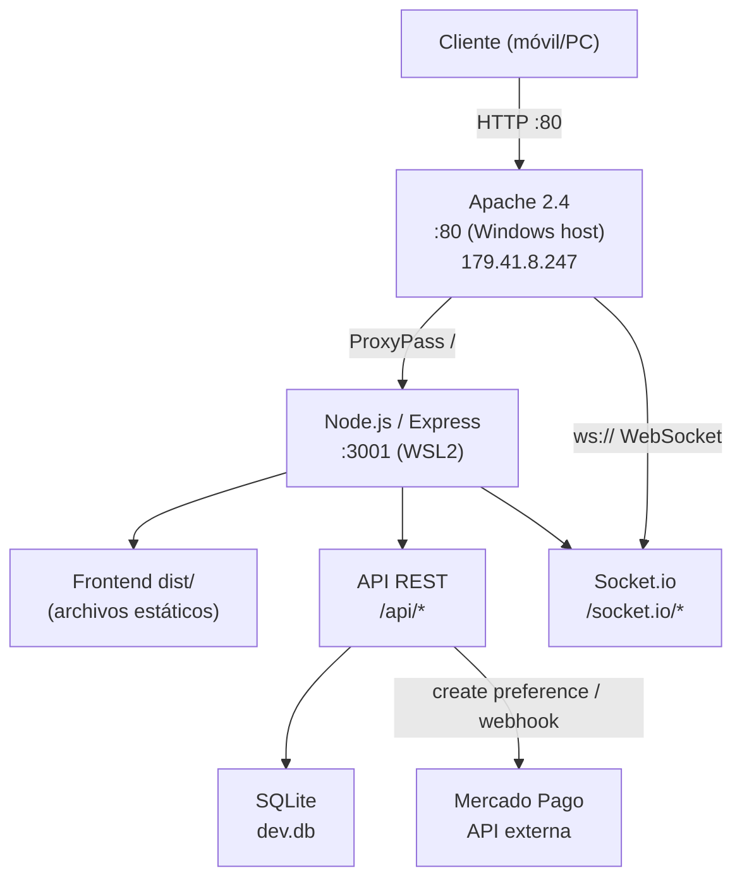
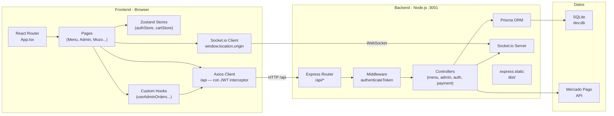
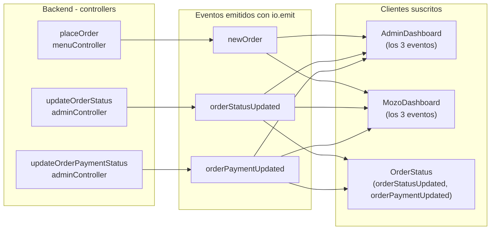
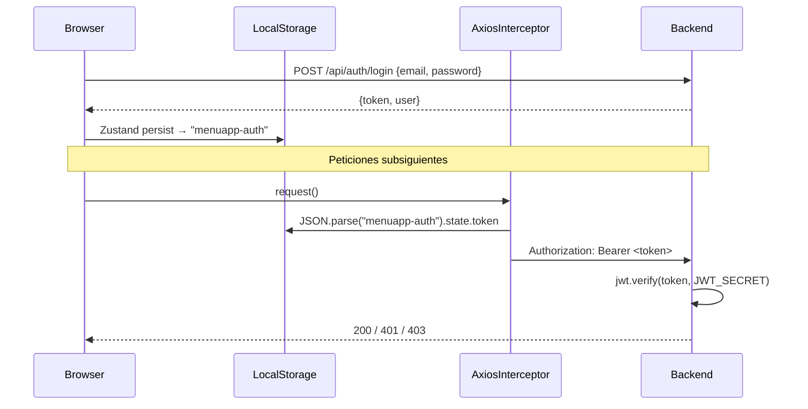

# Arquitectura — MenuApp

## Visión general

MenuApp es una aplicación monolítica en producción: el backend Express sirve tanto la API REST como los archivos estáticos del frontend compilado (SPA). Todo el tráfico entra por Apache 2.4 (Windows host) que actúa como reverse proxy hacia el proceso Node.js corriendo en WSL2.



---

## Estructura de carpetas

```
appmenu/
├── MenuApp-Frontend/src/
│   ├── api/           # Axios client (baseURL: /api)
│   ├── components/    # Componentes reutilizables
│   │   └── admin/     # TableGrid, StockTable, modales
│   ├── context/       # Zustand stores
│   ├── hooks/         # Custom hooks (useAdminOrders, useTableManager)
│   ├── pages/         # Vistas completas de la app
│   ├── types/         # Interfaces TypeScript compartidas
│   └── App.tsx        # BrowserRouter + rutas lazy
│
└── MenuApp-Backend/src/
    ├── controllers/   # Lógica de negocio por dominio
    ├── middleware/    # authenticateToken (JWT)
    ├── routes/        # api.ts — tabla de rutas
    ├── types/         # Extensión de express.Request
    └── index.ts       # Bootstrap: Express + Socket.io + static serving
```

---

## Capas de la aplicación



---

## Routing (Frontend)

| Path | Componente | Acceso |
|------|-----------|--------|
| `/` | `DemoLinks` | Público |
| `/demo` | `DemoLinks` | Público |
| `/m/:slug` | `Menu` | Público |
| `/success` | `PaymentSuccess` | Público |
| `/failure` | `PaymentFailure` | Público |
| `/pending` | `PaymentPending` | Público |
| `/status` | `OrderStatus` | Público |
| `/admin/login` | `Login` | Público |
| `/admin/dashboard` | `AdminDashboard` | Protegido (JWT) |
| `/mozo/dashboard` | `MozoDashboard` | Protegido (JWT) |
| `*` | Redirect `/` | — |

Todas las páginas se cargan con `React.lazy()` + `Suspense`. El componente `ProtectedRoute` redirige a `/admin/login` si no hay token en el store de auth.

---

## Socket.io — Event Map

El servidor no tiene handlers `socket.on` propios. Solo emite eventos desde los controllers cuando la base de datos cambia.



---

## Autenticación y seguridad



El middleware `authenticateToken` adjunta `{ id, email, rol, localId }` a `req.user` para todos los controladores admin.

---

## Decisiones de diseño

### baseURL relativa (`/api`)
En lugar de `http://hostname:3001/api`, el cliente Axios usa `baseURL: '/api'`. Esto permite que Apache proxy el tráfico sin necesidad de configurar CORS por origen y hace que el frontend funcione en cualquier dominio sin recompilar.

### Frontend servido por Express
El backend compila y sirve `dist/` como archivos estáticos. Hay un fallback SPA (`app.get('*')`) que devuelve `index.html` para cualquier ruta no-API, permitiendo que React Router maneje la navegación del lado del cliente.

### Zustand persist
- `authStore`: persiste en `localStorage` (sobrevive al cierre del browser) bajo la clave `menuapp-auth`.
- `cartStore`: persiste en `sessionStorage` (se limpia al cerrar la pestaña) bajo `menuapp-cart`.

### WebSocket origin
La conexión Socket.io del frontend usa `io(window.location.origin)`. Esto funciona tanto en desarrollo (`localhost:5173` con proxy Vite) como en producción (a través del proxy Apache).

### tipoOrden en el pedido
El selector Salón/Retirar en el frontend envía `tipoOrden: 'salon' | 'retirar'` al crear el pedido. Cuando es `retirar`, el campo `mesa` se guarda como `'Retirar'` en la base de datos y no se pide selección de mesa al usuario.
