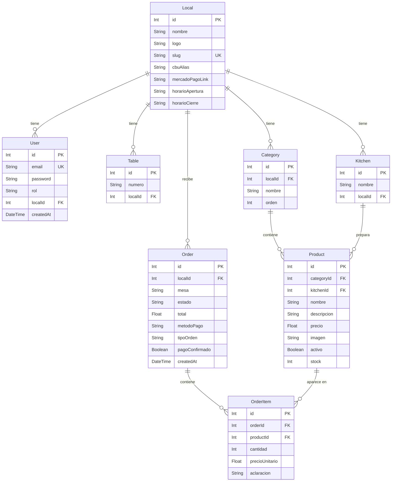

# Base de Datos — MenuApp

Motor: **SQLite** (`prisma/dev.db`)  
ORM: **Prisma v5**  
Schema: `MenuApp-Backend/prisma/schema.prisma`

---

## Diagrama Entidad-Relación



---

## Modelos

### `Local`

Representa un restaurante o local gastronómico. Es la entidad raíz del sistema.

| Campo | Tipo | Obligatorio | Descripción |
|-------|------|:-----------:|-------------|
| `id` | Int | Sí | PK autoincrement |
| `nombre` | String | Sí | Nombre del local |
| `logo` | String? | No | URL de imagen |
| `slug` | String | Sí | Identificador único para URL (`/m/:slug`) |
| `cbuAlias` | String? | No | CBU o alias para pagos por transferencia |
| `mercadoPagoLink` | String? | No | Link directo de Mercado Pago |
| `horarioApertura` | String? | No | Hora de apertura, ej: `"18:00"` |
| `horarioCierre` | String? | No | Hora de cierre, ej: `"00:00"` |

**Relaciones:** tiene `users`, `categorias`, `mesas`, `kitchens`, `pedidos`.

---

### `User`

Usuarios del sistema. Actualmente solo el rol `owner` está en uso.

| Campo | Tipo | Obligatorio | Descripción |
|-------|------|:-----------:|-------------|
| `id` | Int | Sí | PK autoincrement |
| `email` | String | Sí | Único en toda la tabla |
| `password` | String | Sí | Hash bcrypt |
| `rol` | String | Sí | Default `"owner"` |
| `localId` | Int? | No | FK → `Local` |
| `createdAt` | DateTime | Sí | Default `now()` |

**JWT payload firmado:** `{ id, email, rol, localId }`, vigencia 1 día.

---

### `Category`

Agrupaciones de productos dentro de un local (ej: Hamburguesas, Bebidas, Postres).

| Campo | Tipo | Obligatorio | Descripción |
|-------|------|:-----------:|-------------|
| `id` | Int | Sí | PK autoincrement |
| `localId` | Int | Sí | FK → `Local` |
| `nombre` | String | Sí | Nombre de la categoría |
| `orden` | Int | Sí | Posición en el menú (ordenado asc) |

---

### `Product`

Productos del menú. Solo los que tienen `activo: true` aparecen en la vista del cliente.

| Campo | Tipo | Obligatorio | Descripción |
|-------|------|:-----------:|-------------|
| `id` | Int | Sí | PK autoincrement |
| `categoryId` | Int | Sí | FK → `Category` |
| `kitchenId` | Int? | No | FK → `Kitchen` (cocina responsable) |
| `nombre` | String | Sí | Nombre del producto |
| `descripcion` | String? | No | Descripción breve |
| `precio` | Float | Sí | Precio en ARS |
| `imagen` | String? | No | URL o ruta relativa de la imagen |
| `activo` | Boolean | Sí | Default `true`. Si `false`, no aparece en el menú |
| `stock` | Int | Sí | Default `0`. Gestionado desde el panel admin |

---

### `Kitchen`

Cocinas o estaciones de trabajo del local (ej: Cocina Fría, Parrilla, Barra).

| Campo | Tipo | Obligatorio | Descripción |
|-------|------|:-----------:|-------------|
| `id` | Int | Sí | PK autoincrement |
| `nombre` | String | Sí | Nombre de la cocina |
| `localId` | Int | Sí | FK → `Local` |

Los productos pueden asignarse a una cocina para que el admin filtre pedidos por estación.

---

### `Table`

Mesas físicas del local.

| Campo | Tipo | Obligatorio | Descripción |
|-------|------|:-----------:|-------------|
| `id` | Int | Sí | PK autoincrement |
| `numero` | String | Sí | Número o nombre de la mesa (ej: `"1"`, `"VIP"`) |
| `localId` | Int | Sí | FK → `Local` |

---

### `Order`

Pedidos realizados por los clientes.

| Campo | Tipo | Obligatorio | Descripción |
|-------|------|:-----------:|-------------|
| `id` | Int | Sí | PK autoincrement |
| `localId` | Int | Sí | FK → `Local` |
| `mesa` | String | Sí | Número de mesa o `"Retirar"` |
| `estado` | String | Sí | Default `"Recibido"` |
| `total` | Float | Sí | Total en ARS |
| `metodoPago` | String | Sí | `"Efectivo"` \| `"MercadoPago"` |
| `tipoOrden` | String | Sí | Default `"salon"`. Valores: `"salon"` \| `"retirar"` |
| `pagoConfirmado` | Boolean | Sí | Default `false`. Se pone en `true` vía webhook MP |
| `createdAt` | DateTime | Sí | Default `now()` |

**Ciclo de vida del estado:**

```
Recibido → En preparación → Listo → Entregado → Cobrado
```

---

### `OrderItem`

Líneas de cada pedido. Guarda el precio al momento del pedido (no referencia el precio actual del producto).

| Campo | Tipo | Obligatorio | Descripción |
|-------|------|:-----------:|-------------|
| `id` | Int | Sí | PK autoincrement |
| `orderId` | Int | Sí | FK → `Order` |
| `productId` | Int | Sí | FK → `Product` |
| `cantidad` | Int | Sí | Unidades pedidas |
| `precioUnitario` | Float | Sí | Precio al momento del pedido |
| `aclaracion` | String? | No | Nota del cliente (ej: `"sin cebolla"`) |

---

## Comandos Prisma útiles

```bash
# Aplicar migraciones pendientes en desarrollo
npx prisma migrate dev

# Ver estado de las migraciones
npx prisma migrate status

# Poblar la base de datos con datos de prueba
npx prisma db seed

# Abrir Prisma Studio (UI visual de la DB)
npx prisma studio

# Regenerar el cliente Prisma después de cambiar el schema
npx prisma generate
```

---

## Seed inicial

El archivo `prisma/seed.ts` crea:
- 1 local: **Chilli Garden** (`slug: chilligarden`, `horarioApertura: 18:00`)
- 1 usuario admin: `admin@menuapp.com` / `admin123`
- 10 mesas
- Categorías y productos con imágenes reales (`public/images/chilligarden/`)

Para re-ejecutar el seed (borra todos los datos existentes antes de insertar):

```bash
cd MenuApp-Backend
npx prisma db seed
```
