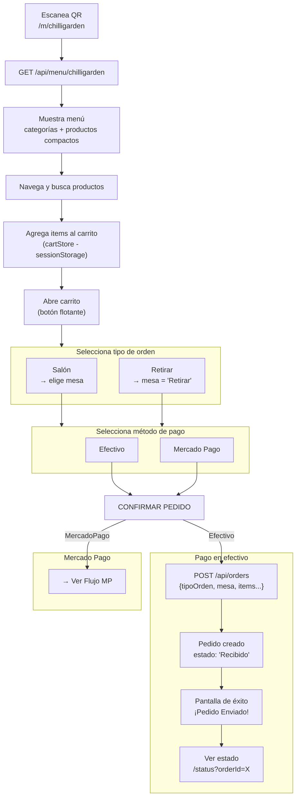
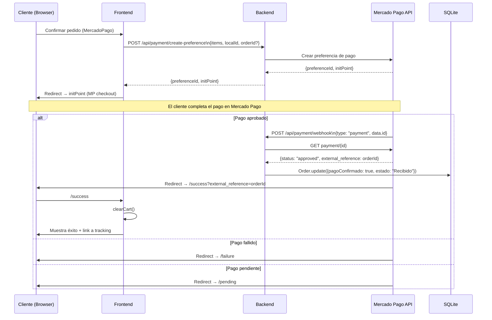
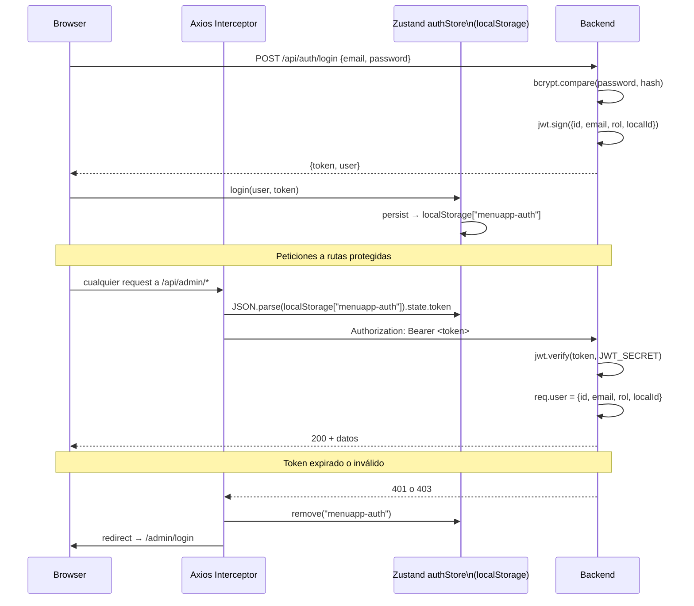
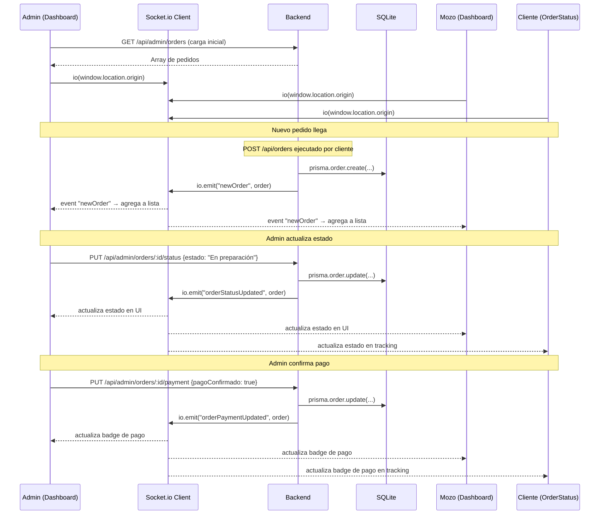
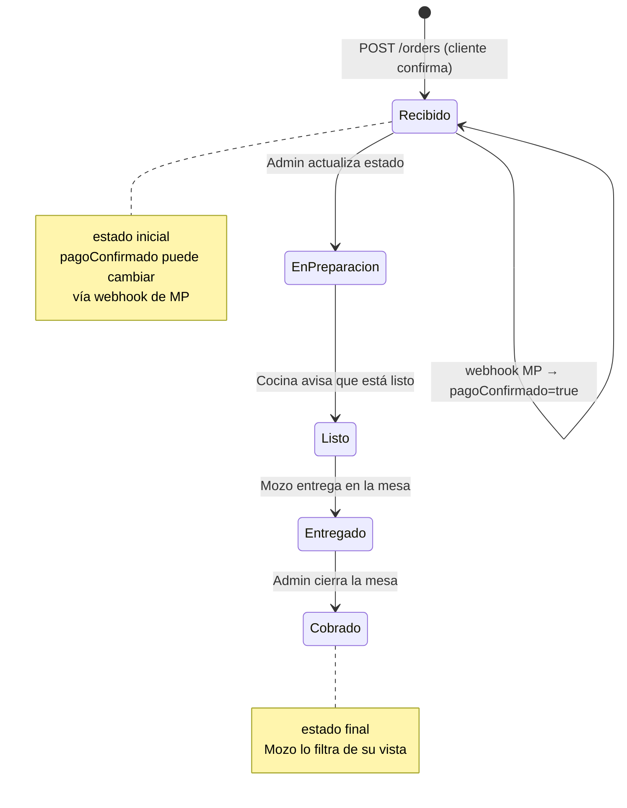
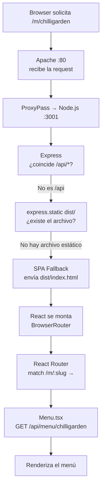

# Diagramas de Flujo — MenuApp

---

## 1. Flujo completo del cliente

Desde que escanea el QR hasta que confirma el pedido.

---

## 2. Flujo de pago con Mercado Pago

---

## 3. Flujo de autenticación JWT

---

## 4. Flujo del panel Admin — gestión de pedidos en tiempo real

---

## 5. Ciclo de vida de un pedido

---

## 6. Flujo de carga inicial de la app (SPA)

