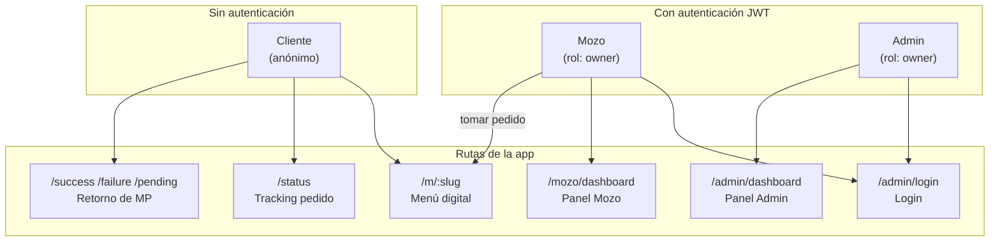
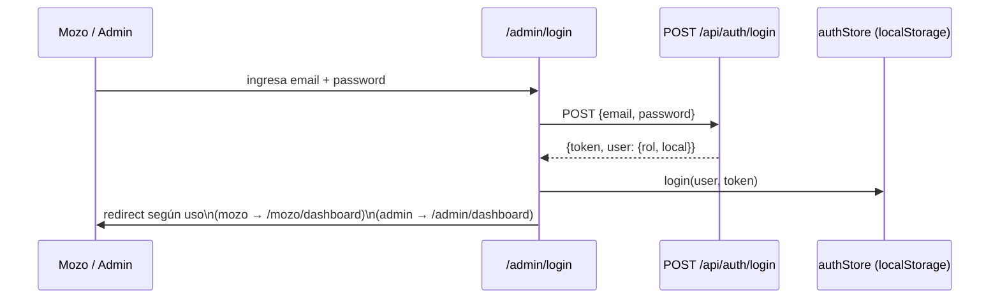

# Tipos de Usuarios — MenuApp

MenuApp tiene tres tipos de usuario con distintos niveles de acceso y funciones. Dos de ellos requieren autenticación (JWT), y uno es completamente anónimo.

---

## Resumen de accesos

| Módulo / Ruta | Cliente | Mozo | Admin |
|---------------|:-------:|:----:|:-----:|
| Menú digital `/m/:slug` | ✅ | ✅ (con mesa pre-cargada) | — |
| Tracking de pedido `/status` | ✅ | — | — |
| Pago Mercado Pago | ✅ | — | — |
| Panel Mozo `/mozo/dashboard` | — | ✅ | — |
| Panel Admin `/admin/dashboard` | — | — | ✅ |
| Gestión de pedidos (estados) | — | Lectura | ✅ |
| Gestión de productos y stock | — | — | ✅ |
| Gestión de mesas | — | Lectura | ✅ |
| Configuración del local | — | — | ✅ |
| Gestión de cocinas | — | — | ✅ |

---

## 1. Cliente

**Tipo de acceso:** Anónimo — sin registro ni login.  
**Cómo accede:** Escanea un código QR con su celular → redirige a `/m/:slug`.

### Funciones

| Función | Descripción |
|---------|-------------|
| Ver menú | Navega por categorías y productos del local. Busca por nombre o descripción. |
| Agregar al carrito | Selecciona productos y los agrega a su carrito (persiste en `sessionStorage`). |
| Elegir tipo de orden | Selector **Salón** (con elección de mesa) o **Retirar** (sin mesa). |
| Elegir método de pago | **Efectivo** (paga al personal) o **Mercado Pago** (redirige al checkout online). |
| Confirmar pedido | Envía el pedido al local. Se notifica al admin y mozo en tiempo real. |
| Pagar con Mercado Pago | Redirige al checkout de MP; el webhook actualiza el estado del pago automáticamente. |
| Ver estado del pedido | Accede a `/status?orderId=X` para seguir el pedido en tiempo real. |

### Rutas accesibles

| Ruta | Descripción |
|------|-------------|
| `/m/:slug` | Menú del local |
| `/success` | Confirmación de pago MP exitoso |
| `/failure` | Notificación de pago fallido |
| `/pending` | Notificación de pago pendiente |
| `/status` | Tracking del pedido |

### APIs que consume

| Endpoint | Acción |
|---------|--------|
| `GET /api/menu/:slug` | Carga el menú completo |
| `POST /api/orders` | Crea el pedido |
| `POST /api/payment/create-preference` | Inicia el pago con MP |
| `GET /api/orders/:id` | Consulta el estado del pedido |

---

## 2. Mozo

**Tipo de acceso:** Autenticado con JWT.  
**Cómo accede:** Login en `/admin/login` → redirige a `/mozo/dashboard`.  
**Rol en la DB:** `owner` (mismo modelo de usuario; diferenciación por flujo de uso).

### Funciones

| Función | Descripción |
|---------|-------------|
| Ver mesas activas | Grid con todas las mesas del local y su estado visual (libre / con pedido). |
| Buscar mesa | Filtro de búsqueda por número de mesa. |
| Ver detalle de mesa | Modal con los pedidos activos en esa mesa: items, estado, estado de pago. |
| Tomar pedido por mesa | Abre el menú del cliente con la mesa pre-seleccionada (`?mesa=X&mozo=true`), sin necesidad de que el cliente escanee un QR. |
| Ver actualizaciones en tiempo real | Recibe eventos `newOrder`, `orderStatusUpdated`, `orderPaymentUpdated` por Socket.io. |
| Filtrar pedidos cobrados | Los pedidos con estado `Cobrado` se ocultan automáticamente de su vista. |

### Lo que el Mozo **NO** puede hacer

- Cambiar el estado de un pedido (solo lectura)
- Modificar productos, stock o configuración del local
- Crear o eliminar mesas
- Ver el panel de admin

### Rutas accesibles

| Ruta | Descripción |
|------|-------------|
| `/admin/login` | Login |
| `/mozo/dashboard` | Panel principal del mozo |
| `/m/:slug?mesa=X&mozo=true` | Menú para tomar pedido desde la mesa (mesa bloqueada) |

### APIs que consume

| Endpoint | Acción |
|---------|--------|
| `POST /api/auth/login` | Autenticación |
| `GET /api/menu/:slug` | Carga datos del local y mesas |
| `GET /api/admin/orders` | Lista de pedidos activos |
| `GET /api/admin/tables` | Lista de mesas |
| `POST /api/orders` | Crea pedido al tomar uno desde la mesa |

---

## 3. Admin (Owner)

**Tipo de acceso:** Autenticado con JWT.  
**Cómo accede:** Login en `/admin/login` → redirige a `/admin/dashboard`.  
**Rol en la DB:** `owner`.

El Admin es el dueño o encargado del local. Tiene acceso total a la gestión del negocio.

### Funciones — Pestaña "Salón"

| Función | Descripción |
|---------|-------------|
| Ver todas las mesas | Grid con estado visual de cada mesa (con/sin pedido activo). |
| Ver detalle de mesa | Modal con items del pedido, subtotales, estado y pago. |
| Cambiar estado del pedido | `Recibido → En preparación → Listo → Entregado → Cobrado`. Notifica en tiempo real. |
| Confirmar pago | Marca el pedido como pagado (Efectivo o MP). Notifica en tiempo real. |
| Cerrar mesa | Marca todos los pedidos de la mesa como `Cobrado` y libera la mesa. |
| Recibir nuevos pedidos en tiempo real | Evento `newOrder` vía Socket.io. También tiene polling de 30s como fallback. |

### Funciones — Pestaña "Stock"

| Función | Descripción |
|---------|-------------|
| Ver todos los productos | Lista con filtros por categoría y cocina, estado de stock. |
| Actualizar stock | Modifica la cantidad disponible de un producto. |
| Crear producto | Formulario completo: nombre, descripción, precio, imagen, categoría, cocina, stock. |
| Gestionar cocinas | Crear y eliminar estaciones de trabajo (Cocina Fría, Parrilla, Barra, etc.). |

### Funciones — Pestaña "Config"

| Función | Descripción |
|---------|-------------|
| Gestionar mesas | Agregar mesas por número, eliminar mesas existentes. |
| Editar datos del local | Nombre, logo, CBU/Alias, link de Mercado Pago. |

### Rutas accesibles

| Ruta | Descripción |
|------|-------------|
| `/admin/login` | Login |
| `/admin/dashboard` | Panel completo de administración |

### APIs que consume

| Endpoint | Acción |
|---------|--------|
| `POST /api/auth/login` | Autenticación |
| `GET /api/admin/orders` | Listar pedidos del local |
| `PUT /api/admin/orders/:id/status` | Cambiar estado del pedido |
| `PUT /api/admin/orders/:id/payment` | Confirmar pago |
| `GET /api/admin/categories` | Listar categorías |
| `GET /api/admin/products` | Listar productos con stock |
| `POST /api/admin/products` | Crear producto |
| `PUT /api/admin/products/:id/stock` | Actualizar stock |
| `GET /api/admin/kitchens` | Listar cocinas |
| `POST /api/admin/kitchens` | Crear cocina |
| `DELETE /api/admin/kitchens/:id` | Eliminar cocina |
| `GET /api/admin/tables` | Listar mesas |
| `POST /api/admin/tables` | Crear mesa |
| `DELETE /api/admin/tables/:id` | Eliminar mesa |
| `GET /api/admin/local` | Ver configuración del local |
| `PUT /api/admin/local` | Actualizar configuración |

---

## Diagrama de acceso por rol

---

## Flujo de autenticación

Tanto el Mozo como el Admin usan el mismo endpoint y formulario de login. La diferencia está en el uso posterior:

> Actualmente no hay distinción de rol automática en el redirect post-login. El usuario es quien elige a qué panel ir. Una futura mejora podría redirigir según el campo `rol` del JWT.

---

## Notas de seguridad por rol

| Aspecto | Cliente | Mozo | Admin |
|---------|:-------:|:----:|:-----:|
| Requiere login | No | Sí | Sí |
| Token JWT | No | Sí (1 día) | Sí (1 día) |
| Token persiste en localStorage | No | Sí | Sí |
| Puede acceder a rutas `/admin/*` | No | No* | Sí |
| Datos sensibles expuestos | No | No | No |

\* El `ProtectedRoute` solo verifica que exista un token válido, no el rol. Si un mozo conoce la URL `/admin/dashboard` y tiene token, podría acceder. Una futura mejora sería validar el campo `rol` en el guard.
